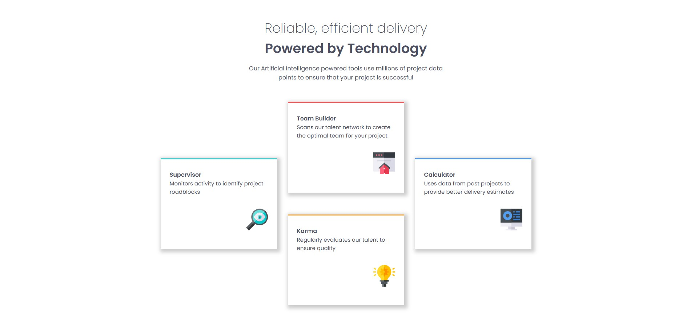

# Frontend Mentor - Four Card Feature Section

This is a solution to the [Four Card Feature Section challenge on Frontend Mentor](https://www.frontendmentor.io/challenges/four-card-feature-section-weK1eFYK).

## Overview

Responsive layout using Flexbox, with future improvements planned using CSS Grid.

### Screenshot

### Links

- [Solution](https://www.frontendmentor.io/solutions/responsive-four-card-feature-section-flexboxgrid-mobile-first-jfFOkC1Ag-)
- [Live Site](https://fernandopizarrodw.github.io/frontend-mentor-four-card-section/)

## Built With

- HTML5
- CSS3
- Flexbox (planned Grid)
- Mobile-first workflow

## What I Learned

I practiced responsive layouts using Flexbox, but next time I’ll consider using CSS Grid to simplify alignment.

## Author

- GitHub - [@fernandopizarrodw](https://github.com/fernandopizarrodw)
- Frontend Mentor - [@fernandopizarrodw](https://www.frontendmentor.io/profile/fernandopizarrodw)
